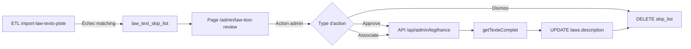

# Revue Manuelle des Textes de Loi

## Vue d'Ensemble

La page **Revue des textes de loi** (`/admin/law-text-review`) permet aux administrateurs de traiter manuellement les dossiers législatifs pour lesquels l'ETL automatique n'a pas pu associer de texte complet Légifrance.

Cette fonctionnalité complète l'ETL `import-law-texts-piste.ts` qui utilise un **matching automatique par similarité Jaccard** pour lier les dossiers AN/Sénat avec les textes officiels Légifrance. Lorsque le score de similarité est insuffisant, le texte trop court, ou introuvable, le dossier est ajouté à une **skip list** pour revue manuelle.

## Problème Résolu

### Contexte

L'ETL automatique tente de matcher les titres de lois NosElus avec les textes Légifrance via :

- Normalisation NLP (suppression accents, ponctuation, stop words)
- Extraction de mots-clés significatifs
- Calcul de similarité Jaccard entre ensembles de mots-clés
- Seuil de confiance par défaut : 0.4 (40%)

### Cas d'échec automatique

| Raison           | Description            | Exemple                            |
| ---------------- | ---------------------- | ---------------------------------- |
| `low_score`      | Score < seuil          | Titre trop différent entre sources |
| `not_found`      | Aucun candidat trouvé  | Loi non encore publiée au JO       |
| `text_too_short` | Texte < 100 caractères | Notice de suppression, métadonnées |

**Conséquence** : ~70% des lois sont enrichies automatiquement, ~30% nécessitent une revue manuelle.

## Architecture

### Flux de Données



### Composants

#### 1. Base de données

**Table `law_text_skip_list`** (créée par migration `0013_whole_beyonder.sql`) :

| Colonne           | Type         | Description                                              |
| ----------------- | ------------ | -------------------------------------------------------- |
| `lawId`           | varchar(100) | ID du dossier NosElus (PK)                               |
| `reason`          | varchar(50)  | Raison de l'échec (low_score, not_found, text_too_short) |
| `bestScore`       | real         | Meilleur score Jaccard trouvé (nullable)                 |
| `bestMatchTitle`  | text         | Titre du meilleur candidat Légifrance (nullable)         |
| `bestMatchTextId` | varchar(100) | textId Légifrance du meilleur candidat (nullable)        |
| `threshold`       | real         | Seuil utilisé lors de la tentative                       |
| `attemptedAt`     | timestamp    | Date de la dernière tentative                            |

#### 2. Module partagé

**`src/lib/server/etl/sources/legifrance/text-matching.ts`** :

Fonctions extraites de l'ETL pour réutilisation :

```typescript
// Constantes
export const MAX_DESCRIPTION_LENGTH = 50000; // Limite stockage DB
export const STOP_WORDS: Set<string>; // Stop words français

// Normalisation NLP
export function normalize(text: string): string;
export function extractKeywords(text: string): Set<string>;

// Similarité Jaccard
export function jaccardSimilarity(set1: Set<string>, set2: Set<string>): number;
export function calculateSimilarity(
	title1: string,
	title2: string,
	debug?: boolean
): { score: number; keywords1: Set<string>; keywords2: Set<string> };

// Extraction de texte depuis API Légifrance
export function extractTextFromResponse(response: LegiTexteResponse): string;
```

#### 3. Client Légifrance étendu

**`src/lib/server/etl/sources/legifrance/client.ts`** :

Nouvelle méthode `searchByKeyword()` pour la recherche manuelle :

```typescript
class LegifranceClient {
	// Existant
	async searchLois(params: {
		nature?: string;
		pageSize?: number;
		pageNumber?: number;
	}): Promise<LegiSearchResponse>;
	async getTexteComplet(textId: string): Promise<LegiTexteResponse>;

	// Nouveau
	async searchByKeyword(params: {
		query: string;
		pageNumber?: number;
		pageSize?: number;
	}): Promise<LegiSearchResponse>;
}
```

**Implémentation** : Utilise l'endpoint `/search` avec filtre `TITLE` et tri par `PERTINENCE`.

#### 4. API Admin

**`src/routes/api/admin/legifrance/+server.ts`** :

Endpoint sécurisé (authentification admin requise) avec deux actions :

##### GET `?action=search`

Recherche par mots-clés sur Légifrance avec calcul de scores Jaccard.

**Paramètres** :
| Param | Type | Requis | Description |
|-------|------|--------|-------------|
| `action` | `'search'` | ✅ | Type d'action |
| `q` | string | ✅ | Mots-clés de recherche |
| `lawTitle` | string | ✅ | Titre du dossier NosElus (pour calcul score) |

**Réponse** :

```typescript
{
	results: Array<{
		id: string; // textId Légifrance
		titre: string; // Titre du texte
		nature: string; // "LOI"
		score: number; // Score Jaccard [0.0 - 1.0+]
	}>;
}
```

**Tri** : Par score décroissant.

##### GET `?action=preview`

Récupère un aperçu du texte complet (500 premiers caractères).

**Paramètres** :
| Param | Type | Requis | Description |
|-------|------|--------|-------------|
| `action` | `'preview'` | ✅ | Type d'action |
| `textId` | string | ✅ | ID Légifrance (ex: `LEGITEXT000123`) |

**Réponse** :

```typescript
{
	textId: string;
	title: string;
	preview: string; // 500 premiers caractères
	totalLength: number; // Taille totale du texte
}
```

**Erreurs** :

- `401 Unauthorized` : Non authentifié
- `400 Bad Request` : Paramètres manquants
- `500 Internal Server Error` : Erreur API Légifrance

#### 5. Page serveur

**`src/routes/admin/law-text-review/+page.server.ts`** :

##### Load Function

**Query SQL** :

```sql
SELECT
  lst.lawId, lst.reason, lst.bestScore, lst.bestMatchTitle, lst.bestMatchTextId,
  lst.attemptedAt, lst.threshold,
  l.title AS lawTitle, l.shortTitle AS lawShortTitle, l.number AS lawNumber,
  l.type AS lawType, l.status AS lawStatus, l.legislature AS lawLegislature,
  l.theme AS lawTheme, l.initiator AS lawInitiator,
  l.depositDate AS lawDepositDate, l.promulgationDate AS lawPromulgationDate,
  l.sourceUrl AS lawSourceUrl
FROM law_text_skip_list lst
INNER JOIN laws l ON lst.lawId = l.id
WHERE (reason = :reasonFilter OR :reasonFilter IS NULL)
ORDER BY lst.attemptedAt DESC
LIMIT 20 OFFSET :offset
```

**Paramètres URL** :

- `?page=N` : Numéro de page (défaut: 1)
- `?reason=<reason>` : Filtre par raison (optionnel)

**Données retournées** :

```typescript
{
	entries: Array<SkipListEntry>; // Entrées paginées
	counts: Record<string, number>; // Compteurs par raison
	totalCount: number; // Total toutes raisons
	page: number; // Page actuelle
	totalPages: number; // Nombre total de pages
	reasonFilter: string; // Filtre actif
	pisteConfigured: boolean; // PISTE_CLIENT_ID et SECRET définis ?
}
```

##### Form Actions

**1. `approve`** : Approuve le meilleur candidat proposé

```typescript
// POST ?/approve
FormData {
  lawId: string;    // ID du dossier NosElus
  textId: string;   // textId Légifrance du candidat
}
```

**Traitement** :

1. Récupère le texte complet via `getTexteComplet(textId)`
2. Extrait le texte via `extractTextFromResponse()`
3. Valide longueur minimale (100 caractères)
4. Met à jour `laws.description` (tronqué à 50 000 caractères)
5. Supprime l'entrée de `law_text_skip_list`

**2. `associate`** : Associe manuellement un textId différent

Même traitement que `approve`, mais avec un textId choisi manuellement par l'admin (depuis les résultats de recherche).

**3. `dismiss`** : Ignore définitivement l'entrée

```typescript
// POST ?/dismiss
FormData {
  lawId: string;
}
```

**Traitement** :

1. Supprime l'entrée de `law_text_skip_list`
2. Ne modifie PAS `laws.description` (reste NULL)

**Erreurs** :

- `401 Unauthorized` : Non authentifié
- `400 Bad Request` : Paramètres manquants ou texte trop court
- `500 Internal Server Error` : Erreur API Légifrance

#### 6. Page Svelte

**`src/routes/admin/law-text-review/+page.svelte`** :

Interface en **cartes** (remplace le tableau initial) avec :

**Layout** :

```
┌─────────────────────────────────────────────────────┐
│ [Filtres: Tous (42) | Score faible (28) | ...]      │
├─────────────────────────────────────────────────────┤
│ ┌─── Entrée 1 ───────────────────────────────────┐ │
│ │ [Badge raison] Score: 0.35 | 2026-02-09 14:30  │ │
│ │ [Approuver] [Rechercher] [Ignorer]             │ │
│ ├─────────────────────────────────────────────────┤ │
│ │ DOSSIER LEGISLATIF  │  CANDIDAT LEGIFRANCE     │ │
│ │ - Titre complet     │  - Titre candidat        │ │
│ │ - ID: DLR5L17N...   │  - TextId: LEGITEXT...   │ │
│ │ - Numéro: 2025-123  │  - Seuil: 0.40           │ │
│ │ - Type: PL          │  [Voir le texte]         │ │
│ │ - Statut: promulgué │  └─ Aperçu (500 chars)   │ │
│ │ - Législature: 17   │                           │ │
│ │ - Thème: Finances   │                           │ │
│ │ - Initiateur: Gouv. │                           │ │
│ │ - Dépôt: 2024-10-15 │                           │ │
│ │ - Promulgation: ... │                           │ │
│ │ - URL source: [🔗]  │                           │ │
│ ├─────────────────────────────────────────────────┤ │
│ │ [PANNEAU RECHERCHE EXTENSIBLE]                  │ │
│ │ [_Mots-clés: _______] [Chercher]               │ │
│ │ 1. LOI n°2024-120 (score 0.52) [Aperçu][Assoc.]│ │
│ │    └─ Aperçu: "Article 1er - ..." (500c)       │ │
│ └─────────────────────────────────────────────────┘ │
└─────────────────────────────────────────────────────┘
[< 1 2 3 >] Pagination
```

**État Svelte 5 (runes)** :

```typescript
let expandedEntry = $state<string | null>(null); // lawId du panneau recherche ouvert
let searchQuery = $state(''); // Mots-clés de recherche
let searchResults = $state<SearchResult[]>([]); // Résultats de recherche
let searchLoading = $state(false); // Chargement recherche
let candidatePreviewId = $state<string | null>(null); // textId de l'aperçu candidat principal
let candidatePreviewContent = $state<string | null>(null);
let previewTextId = $state<string | null>(null); // textId de l'aperçu dans résultats recherche
let previewContent = $state<string | null>(null);
let actionMessage = $state<{ type: 'success' | 'error'; text: string } | null>(null);
```

**Fonctionnalités** :

1. **Filtrage par raison** : Badges cliquables avec compteurs
2. **Aperçu candidat principal** : Bouton "Voir le texte" → charge 500 premiers caractères
3. **Recherche manuelle** : Bouton "Rechercher" → panneau extensible
   - Saisie mots-clés → recherche Légifrance
   - Résultats triés par score Jaccard
   - Aperçu individuel par résultat
   - Bouton "Associer" pour chaque résultat
4. **Actions** :
   - Approuver : Valide le candidat proposé automatiquement
   - Rechercher : Ouvre le panneau de recherche manuelle
   - Ignorer : Supprime de la skip list sans association
5. **Pagination** : 20 entrées par page

**Responsive** : Layout deux colonnes → une colonne sur mobile (< 768px).

#### 7. Navigation Admin

**`src/routes/admin/+layout.svelte`** :

Layout partagé avec barre de navigation persistante :

```svelte
┌─────────────────────────────────────────────────┐ │ [Admin] Positions | État ETL | Revue textes │
│ [Déconnexion] │ └─────────────────────────────────────────────────┘ ↓
{@render children()}
```

**Navigation** :

- **Positions** (`/admin`) : Gestion positions politiques groupes
- **État ETL** (`/admin/etl-status`) : Dashboard checks ETL
- **Revue textes de loi** (`/admin/law-text-review`) : Cette fonctionnalité

**Active link highlighting** : Utilise `$page.url.pathname` pour surligner l'onglet actif.

## Utilisation

### Prérequis

1. **Variables d'environnement** (`.env`) :

   ```bash
   PISTE_CLIENT_ID=your-oauth-client-id
   PISTE_CLIENT_SECRET=your-oauth-client-secret
   PISTE_ENV=production  # ou "sandbox" pour tests
   ```

2. **Authentification admin** :

   ```bash
   ADMIN_PASSWORD=your-secure-password
   ```

3. **Base de données** : Migration `0013_whole_beyonder.sql` appliquée
   ```bash
   npm run db:migrate
   ```

### Workflow Typique

#### 1. Exécuter l'ETL automatique

```bash
# Enrichir les lois sans texte complet
make etl-an-law-texts
# ou
npm run etl:law-texts -- --limit 50
```

**Résultat** : Les échecs sont ajoutés à `law_text_skip_list`.

#### 2. Accéder à la page de revue

1. Naviguer vers `http://localhost:5173/admin` (ou URL de production)
2. Se connecter avec le mot de passe admin
3. Cliquer sur **"Revue textes de loi"** dans la navigation

#### 3. Filtrer les entrées

Cliquer sur un badge de raison pour filtrer :

- **Tous (42)** : Toutes les entrées
- **Score faible (28)** : Candidat trouvé mais score < seuil
- **Non trouvé (10)** : Aucun candidat Légifrance
- **Texte trop court (4)** : Candidat invalide

#### 4. Traiter une entrée

**Cas 1 : Le candidat proposé semble correct**

1. Cliquer sur **"Voir le texte"** pour prévisualiser (500 caractères)
2. Vérifier que le texte correspond au dossier législatif
3. Cliquer sur **"Approuver"**
   - ✅ Le texte complet est associé au dossier
   - ✅ L'entrée disparaît de la skip list

**Cas 2 : Le candidat proposé est incorrect ou absent**

1. Cliquer sur **"Rechercher"**
2. Saisir des mots-clés du titre (ex: "finances 2025 agriculture")
3. Cliquer sur **"Chercher"**
   - Les résultats apparaissent triés par score Jaccard
4. Pour chaque résultat :
   - Cliquer sur **"Aperçu"** pour prévisualiser
   - Si correct, cliquer sur **"Associer"**
     - ✅ Le texte complet est associé au dossier
     - ✅ L'entrée disparaît de la skip list

**Cas 3 : Aucun texte Légifrance ne correspond**

1. Vérifier que le dossier est bien promulgué (sinon, texte pas encore publié au JO)
2. Si promulgué mais introuvable : cliquer sur **"Ignorer"**
   - ✅ L'entrée disparaît de la skip list
   - ℹ️ Le dossier conserve `description = NULL` (sera affiché comme "Métadonnées uniquement" dans l'UI publique)

#### 5. Pagination

Utiliser les boutons `< 1 2 3 >` en bas de page pour naviguer entre les 20 entrées par page.

## Configuration

### Paramètres ETL

**Fichier** : `scripts/etl/import-law-texts-piste.ts`

```bash
# Limite de lois à traiter
npm run etl:law-texts -- --limit 100

# Ajuster le seuil de similarité (défaut: 0.4)
npm run etl:law-texts -- --threshold 0.5

# Mode verbeux (affiche détails matching)
npm run etl:law-texts -- --verbose

# Mode dry-run (n'écrit pas en base)
npm run etl:law-texts -- --dry-run

# Forcer re-tentative (ignore skip list)
npm run etl:law-texts -- --force
```

### Seuil de Similarité

**Valeur par défaut** : `0.4` (40%)

**Ajustement** :

- **Seuil trop bas** (< 0.3) : Trop de faux positifs automatiques → plus de `low_score` en skip list
- **Seuil trop haut** (> 0.5) : Trop de vrais négatifs → moins d'enrichissement automatique

**Recommandation** : Valider empiriquement sur un échantillon de 20-30 lois.

### Taille du Texte

**Constante** : `MAX_DESCRIPTION_LENGTH = 50000` caractères

**Justification** :

- Limite PostgreSQL `text` : ~1 GB (largement suffisant)
- Limite pratique : 50 KB = ~10-15 pages A4
- Les lois très longues (> 50 KB) sont rares et tronquées proprement

**Modification** : Éditer `src/lib/server/etl/sources/legifrance/text-matching.ts` si besoin.

## Monitoring

### Métriques ETL

Après chaque run ETL, consulter les logs :

```
=======================================================================
Résultats:
  Total traité:       50 dossiers
  Enrichis:           35  (70%)
  Score insuffisant:  10  (20%)
  Non trouvés:        3   (6%)
  Erreurs:            2   (4%)
=======================================================================
```

**Objectifs** :

- **Enrichis** : > 70%
- **Score insuffisant** : < 25%
- **Erreurs** : < 5%

### Métriques Skip List

Requête SQL pour suivre l'évolution :

```sql
-- Compteurs par raison
SELECT reason, COUNT(*) AS count
FROM law_text_skip_list
GROUP BY reason
ORDER BY count DESC;

-- Tendance temporelle
SELECT
  DATE(attempted_at) AS date,
  COUNT(*) AS entries_added
FROM law_text_skip_list
GROUP BY DATE(attempted_at)
ORDER BY date DESC
LIMIT 7;
```

**Alertes** :

- **> 100 entrées en skip list** : Revoir le seuil ou améliorer l'algorithme de matching
- **Croissance rapide** : Possible problème API Légifrance (rate limiting, changement format)

## Maintenance

### Nettoyage de la Skip List

Si des entrées anciennes (> 6 mois) restent non traitées :

```sql
-- Identifier les entrées obsolètes
SELECT lawId, reason, attempted_at
FROM law_text_skip_list
WHERE attempted_at < NOW() - INTERVAL '6 months'
ORDER BY attempted_at ASC;

-- Supprimer après validation manuelle
DELETE FROM law_text_skip_list
WHERE lawId IN ('DLR5L17N...', 'DLR5L16N...');
```

### Re-tentative en Batch

Si l'algorithme de matching est amélioré, re-tenter les échecs précédents :

```bash
# Vider la skip list (optionnel, backup recommandé)
# psql -c "TRUNCATE law_text_skip_list;"

# Re-lancer l'ETL avec --force
npm run etl:law-texts -- --force --limit 100
```

### Mise à Jour de l'Algorithme

Si le taux de matching automatique est insuffisant :

1. Ajuster `STOP_WORDS` dans `text-matching.ts`
2. Modifier les bonus de mots discriminants (années, mots longs)
3. Tester sur un échantillon avec `--verbose --dry-run`
4. Valider manuellement 20-30 cas
5. Déployer et re-lancer l'ETL avec `--force`

## Sécurité

### Authentification

- **Endpoint API** : Vérification `locals.adminAuthenticated` obligatoire
- **Page admin** : Redirection automatique si non authentifié (géré par `+layout.server.ts`)

### Credentials Légifrance

- **Stockage** : Variables d'environnement uniquement (`.env`, **JAMAIS commitées**)
- **Rotation** : Possible via portail PISTE (régénération client_secret)
- **Quotas** : Monitoring recommandé pour détecter usage anormal

### Données Sensibles

- **Skip list** : Contient uniquement IDs et métadonnées publiques (pas de données personnelles)
- **Textes de loi** : Données publiques open data (pas de restriction)

## Tests

### Tests Unitaires

**Fichier** : `src/lib/server/etl/sources/legifrance/__tests__/text-matching.test.ts` (à créer)

```typescript
import { describe, it, expect } from 'vitest';
import { calculateSimilarity, normalize, extractKeywords } from '../text-matching';

describe('text-matching', () => {
	describe('normalize', () => {
		it('supprime accents', () => {
			expect(normalize('élève')).toBe('eleve');
		});

		it('supprime ponctuation', () => {
			expect(normalize("l'éducation")).toBe('l education');
		});

		it('supprime stop words', () => {
			expect(normalize('la loi de finances')).toBe('loi finances');
		});
	});

	describe('calculateSimilarity', () => {
		it('match exact = 1.0', () => {
			const { score } = calculateSimilarity('loi finances 2025', 'loi finances 2025');
			expect(score).toBe(1.0);
		});

		it('bonus pour année', () => {
			const { score } = calculateSimilarity('loi 2025', 'loi 2025');
			expect(score).toBeGreaterThan(1.0); // Bonus année
		});

		it('score faible si titres différents', () => {
			const { score } = calculateSimilarity('loi agriculture', 'loi éducation');
			expect(score).toBeLessThan(0.3);
		});
	});
});
```

### Tests d'Intégration

**Fichier** : `src/routes/admin/law-text-review/__tests__/+page.test.ts` (à créer)

```typescript
import { describe, it, expect } from 'vitest';
import { render, screen } from '@testing-library/svelte';
import Page from '../+page.svelte';

describe('law-text-review page', () => {
	it('affiche le titre', () => {
		const data = {
			entries: [],
			counts: {},
			totalCount: 0,
			page: 1,
			totalPages: 0,
			reasonFilter: '',
			pisteConfigured: true
		};

		render(Page, { data });
		expect(screen.getByText(/Revue des textes de loi/i)).toBeInTheDocument();
	});

	it('affiche les filtres avec compteurs', () => {
		const data = {
			entries: [],
			counts: { low_score: 28, not_found: 10 },
			totalCount: 38
			// ...
		};

		render(Page, { data });
		expect(screen.getByText('Tous (38)')).toBeInTheDocument();
		expect(screen.getByText('Score faible (28)')).toBeInTheDocument();
	});
});
```

### Tests End-to-End

**Scénario** : Workflow complet de revue manuelle

```typescript
// playwright.config.ts
test('law text review workflow', async ({ page }) => {
	// 1. Login admin
	await page.goto('/admin');
	await page.fill('input[name="password"]', process.env.ADMIN_PASSWORD!);
	await page.click('button[type="submit"]');

	// 2. Naviguer vers revue textes
	await page.click('a[href="/admin/law-text-review"]');
	await expect(page).toHaveURL('/admin/law-text-review');

	// 3. Filtrer par "Score faible"
	await page.click('text=Score faible');
	await expect(page).toHaveURL(/reason=low_score/);

	// 4. Ouvrir recherche sur première entrée
	await page.click('button:has-text("Rechercher")').first();
	await expect(page.locator('.search-panel')).toBeVisible();

	// 5. Chercher et prévisualiser
	await page.fill('input[placeholder*="mots-clés"]', 'finances 2025');
	await page.click('button:has-text("Chercher")');
	await page.click('button:has-text("Aperçu")').first();
	await expect(page.locator('.preview-content')).toBeVisible();

	// 6. Associer
	await page.click('button:has-text("Associer")').first();
	await expect(page.locator('text=Association réussie')).toBeVisible();
});
```

## Dépannage

### Problème : API Légifrance retourne 401

**Cause** : Credentials PISTE invalides ou expirés.

**Solution** :

1. Vérifier `.env` : `PISTE_CLIENT_ID` et `PISTE_CLIENT_SECRET`
2. Tester connexion : `npm run etl:law-texts -- --test-connection`
3. Si échec : régénérer credentials sur https://piste.gouv.fr

### Problème : Beaucoup de `not_found` dans skip list

**Cause** : Lois non encore publiées au JO, ou API Légifrance en retard.

**Solution** :

1. Vérifier statut du dossier : doit être `"promulgué"`
2. Attendre quelques jours (délai publication JO : 1-7 jours)
3. Re-lancer l'ETL avec `--force` après mise à jour API

### Problème : Scores de matching trop faibles

**Cause** : Titres trop différents entre AN et Légifrance.

**Solution** :

1. Ajuster seuil : `--threshold 0.35` (attention aux faux positifs)
2. Améliorer normalisation : ajouter stop words dans `text-matching.ts`
3. Utiliser recherche manuelle via UI admin

### Problème : Textes trop courts (< 100 chars)

**Cause** : Résultat API Légifrance est une notice de suppression ou métadonnée.

**Solution** :

1. Vérifier manuellement sur legifrance.gouv.fr
2. Si vraiment supprimé : cliquer "Ignorer" dans l'UI admin
3. Si texte existe mais mal extrait : débugger `extractTextFromResponse()`

## Évolutions Futures

### Priorisation par Votes

Enrichir d'abord les lois liées aux scrutins (plus de valeur pour l'UI publique).

**Implémentation** :

```sql
-- Requête load() modifiée
SELECT lst.*, l.*, COUNT(s.id) AS vote_count
FROM law_text_skip_list lst
INNER JOIN laws l ON lst.lawId = l.id
LEFT JOIN scrutins s ON s.lawId = l.id
GROUP BY lst.lawId, l.id
ORDER BY vote_count DESC, lst.attemptedAt DESC
```

### Suggestion Automatique de Mots-Clés

Pré-remplir le champ de recherche avec des mots-clés extraits du titre AN.

**Implémentation** :

```typescript
// Dans +page.svelte
function suggestKeywords(lawTitle: string): string {
	return extractKeywords(lawTitle)
		.values()
		.toArray()
		.slice(0, 5) // Top 5 mots-clés
		.join(' ');
}
```

### Batch Association

Permettre d'approuver/rejeter plusieurs entrées en une fois.

**UI** :

- Checkbox par entrée
- Bouton "Approuver sélection" / "Ignorer sélection"

### Historique des Actions

Tracer qui a approuvé/rejeté chaque entrée (audit trail).

**Schema** :

```sql
CREATE TABLE law_text_review_history (
  id SERIAL PRIMARY KEY,
  law_id VARCHAR(100) NOT NULL,
  action VARCHAR(20) NOT NULL, -- 'approve', 'associate', 'dismiss'
  text_id VARCHAR(100),
  reviewed_by VARCHAR(100),
  reviewed_at TIMESTAMP DEFAULT NOW()
);
```

## Références

- **ADR-003** : [Récupération du Texte Complet des Lois](../../.serena/memories/adr-2026-02-02-law-full-text-retrieval.md)
- **Pattern** : [Jaccard Title Matching](../../.serena/memories/pattern-jaccard-title-matching.md)
- **API Légifrance** : [Documentation PISTE](https://piste.gouv.fr/api-catalog-sandbox)
- **Migration DB** : `drizzle/migrations/0013_whole_beyonder.sql`

## Auteurs

- **Implémentation** : Claude Opus 4.6 (2026-02-10)
- **Revue** : Fred (utilisateur)
- **Branche** : `feat/etl-improve`

## Changelog

| Date       | Version | Changements                      |
| ---------- | ------- | -------------------------------- |
| 2026-02-10 | 1.0     | Implémentation initiale complète |
