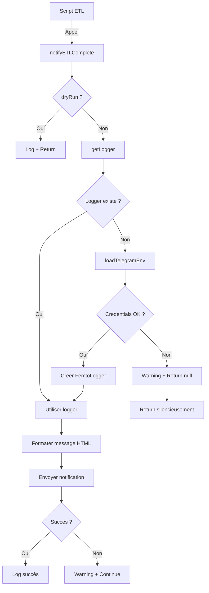

# Notifications Telegram des ETL

> Système de notifications Telegram pour surveiller l'exécution des scripts ETL

---

## Table des Matières

- [Vue d'ensemble](#vue-densemble)
- [Installation](#installation)
- [Configuration](#configuration)
- [Utilisation](#utilisation)
- [Format des Messages](#format-des-messages)
- [Dépannage](#dépannage)
- [Architecture](#architecture)
- [API Reference](#api-reference)

---

## Vue d'ensemble

Le système de notifications Telegram permet de recevoir une notification automatique à la fin de chaque script ETL, indiquant :
- Le statut d'exécution (succès ✅, partiel ⚠️, échec ❌)
- Les statistiques détaillées (total, insérés, mis à jour, ignorés, erreurs)
- Le taux de succès calculé automatiquement
- La législature concernée (si applicable)

**Fonctionnalités clés** :
- **Graceful degradation** : Si Telegram n'est pas configuré, l'ETL continue normalement avec un warning
- **Respect du --dry-run** : Aucune notification envoyée en mode simulation
- **Error handling** : Un échec de notification ne crashe jamais l'ETL
- **Singleton lazy** : Le logger Telegram est initialisé une seule fois au premier usage

---

## Installation

### 1. Package NPM

Le package FemtoLogger est déjà installé dans le projet :

```bash
npm install @frederictriquet/femtologger@^0.1.4
```

### 2. Créer un Bot Telegram

1. Ouvrir Telegram et rechercher **@BotFather**
2. Envoyer `/newbot`
3. Suivre les instructions :
   - Nom du bot (ex: "NosElus Notifications")
   - Username (doit finir par "bot", ex: "noselus_bot")
4. **Copier le token fourni** (format: `123456789:ABCdefGHIjkl...`)

### 3. Obtenir votre Chat ID

1. Rechercher **@userinfobot** dans Telegram
2. Envoyer `/start`
3. **Copier l'ID fourni** (format: `123456789`)

Alternativement, pour un groupe :
1. Ajouter le bot au groupe
2. Envoyer un message dans le groupe
3. Visiter `https://api.telegram.org/bot<TOKEN>/getUpdates`
4. Chercher `"chat":{"id":...}` dans la réponse

---

## Configuration

### Variables d'environnement

Ajouter dans votre fichier `.env` :

```bash
# ========================================
# Telegram Notifications (ETL)
# ========================================
# Token du bot Telegram (@BotFather)
TELEGRAM_BOT_TOKEN=123456789:ABCdefGHIjklMNOpqrsTUVwxyz

# Chat ID de l'utilisateur/groupe destinataire (@userinfobot)
TELEGRAM_CHAT_ID=123456789
```

**⚠️ Important** :
- Ne **jamais committer** le fichier `.env` (déjà dans `.gitignore`)
- Utiliser `.env.example` comme référence
- En production, configurer les variables via votre hébergeur

### Vérification

Pour vérifier que la configuration fonctionne :

```bash
# Lancer un ETL simple en production (sans --dry-run)
npm run etl:enrich-pe-group-names

# Vous devriez recevoir une notification Telegram
```

---

## Utilisation

### Dans un script ETL existant

Tous les 31 scripts ETL du projet sont déjà configurés. Pour ajouter des notifications à un nouveau script :

```typescript
import { notifyETLComplete } from '../../src/lib/server/etl/notifications.js';
import type { ImportStats } from '../../src/lib/server/etl/types.js';

async function main() {
  const dryRun = process.argv.includes('--dry-run');

  // ... logique ETL ...

  const stats: ImportStats = {
    total: 100,
    inserted: 80,
    updated: 15,
    skipped: 3,
    errors: 2
  };

  // Notification Telegram
  await notifyETLComplete('mon-etl-script', stats, {
    dryRun,
    legislature: 'AN-17', // optionnel
    additionalInfo: { duration: '45s' } // optionnel
  });
}
```

### Flags --dry-run

```bash
# Mode simulation : aucune notification envoyée
npm run etl:import-actors -- --dry-run

# Mode production : notification envoyée
npm run etl:import-actors
```

En mode `--dry-run`, le script affiche dans les logs :
```
[DRY-RUN] Would send Telegram notification for: import-actors
[DRY-RUN] Stats: {"total":577,"inserted":450,...}
```

### Scripts multi-étapes

Pour les ETL combinant plusieurs opérations, combiner les stats avant la notification :

```typescript
const organsStats = await importOrgans(config);
const actorsStats = await importActors(config);
const mandatesStats = await importMandates(config);

// Combiner les stats
const combinedStats: ImportStats = {
  total: organsStats.total + actorsStats.total + mandatesStats.total,
  inserted: organsStats.inserted + actorsStats.inserted + mandatesStats.inserted,
  updated: organsStats.updated + actorsStats.updated + mandatesStats.updated,
  skipped: organsStats.skipped + actorsStats.skipped + mandatesStats.skipped,
  errors: organsStats.errors + actorsStats.errors + mandatesStats.errors
};

await notifyETLComplete('import-all', combinedStats, {
  dryRun,
  legislature: config.legislature,
  additionalInfo: {
    organs: organsStats.inserted,
    actors: actorsStats.inserted,
    mandates: mandatesStats.inserted
  }
});
```

---

## Format des Messages

### Succès total (0 erreur)

```
✅ ETL Terminé: import-actors (AN-17)

📊 Résultats:
  • Total: 577
  • Insérés: 450
  • Mis à jour: 127
  • Ignorés: 0
  • Erreurs: 0
  • Taux de succès: 100.0%
```

### Succès partiel (< 10% d'erreurs)

```
⚠️ ETL Terminé: import-scrutins (AN-17)

📊 Résultats:
  • Total: 1250
  • Insérés: 1180
  • Mis à jour: 50
  • Ignorés: 10
  • Erreurs: 10
  • Taux de succès: 99.2%
```

### Échec significatif (≥ 10% d'erreurs)

```
❌ ETL Terminé: import-europarl-laws (PE-10)

📊 Résultats:
  • Total: 2039
  • Insérés: 1800
  • Mis à jour: 50
  • Ignorés: 0
  • Erreurs: 189
  • Taux de succès: 90.7%
```

### Formatage HTML

Les messages utilisent le formatage HTML de Telegram :
- **Gras** : `<b>texte</b>`
- Emojis : ✅ ⚠️ ❌ 📊
- Retours à la ligne : `\n`

---

## Dépannage

### Problème : Pas de notification reçue

**Vérifications** :

1. **Variables d'environnement** :
   ```bash
   # Vérifier que les variables sont chargées
   node -e "require('dotenv').config(); console.log(process.env.TELEGRAM_BOT_TOKEN)"
   ```

2. **Token valide** :
   - Format : `123456789:ABCdefGHI...` (chiffres + `:` + lettres)
   - Tester avec `https://api.telegram.org/bot<TOKEN>/getMe`

3. **Chat ID valide** :
   - Format : nombre entier (ex: `123456789`)
   - Pour un groupe : commence par `-` (ex: `-123456789`)

4. **Bot ajouté au chat** :
   - Pour un chat privé : envoyer `/start` au bot
   - Pour un groupe : ajouter le bot comme membre

5. **Mode dry-run** :
   ```bash
   # Vérifier que --dry-run n'est pas actif
   npm run etl:import-actors  # Sans --dry-run
   ```

### Problème : Script crashe au démarrage

**Symptôme** : `Failed to initialize Telegram logger`

**Cause** : Problème avec le package FemtoLogger

**Solution** :
```bash
# Réinstaller le package
rm -rf node_modules package-lock.json
npm install
```

### Problème : Messages non formatés (balises HTML visibles)

**Cause** : Version de FemtoLogger < 0.1.4

**Solution** :
```bash
# Mettre à jour vers v0.1.4+
npm install @frederictriquet/femtologger@^0.1.4
```

### Problème : Warning "credentials not configured"

**Symptôme** :
```
⚠️  Telegram credentials not configured (TELEGRAM_BOT_TOKEN or TELEGRAM_CHAT_ID missing).
   ETL notifications will be skipped. See .env.example for setup instructions.
```

**Cause** : Variables manquantes dans `.env`

**Solution** :
1. Créer/compléter le fichier `.env` à la racine du projet
2. Ajouter `TELEGRAM_BOT_TOKEN` et `TELEGRAM_CHAT_ID`
3. Relancer le script

**Note** : Ce warning n'empêche pas l'ETL de fonctionner.

---

## Architecture

### Structure

```
src/lib/server/etl/
├── notifications.ts          # Module centralisé (244 lignes)
│   ├── loadTelegramEnv()    # Charge .env
│   ├── getLogger()          # Singleton lazy
│   ├── notifyETLComplete()  # Fonction principale
│   └── getStatusEmoji()     # Calcul emoji contextuel
├── types.ts                 # Interface ImportStats
└── utils.ts                 # Utilitaires ETL standards
```

### Flux d'exécution



### Principes de design

1. **Graceful degradation** :
   - Credentials manquants → warning + skip
   - Erreur d'envoi → warning + continue
   - **L'ETL ne crashe jamais à cause des notifications**

2. **Singleton lazy** :
   - Logger créé au premier appel
   - Réutilisé pour tous les appels suivants
   - Évite les connexions multiples

3. **Respect --dry-run** :
   - Check centralisé dans `notifyETLComplete()`
   - Impossible d'oublier dans un script
   - Log explicite en mode dry-run

4. **Type-safe** :
   - Interface `ImportStats` partagée
   - Interface `NotifyOptions` typée
   - TypeScript strict mode

---

## API Reference

### `notifyETLComplete()`

```typescript
async function notifyETLComplete(
  scriptName: string,
  stats: ImportStats,
  options?: NotifyOptions
): Promise<void>
```

**Paramètres** :

| Param | Type | Requis | Description |
|-------|------|--------|-------------|
| `scriptName` | `string` | ✅ | Nom du script ETL (ex: "import-actors") |
| `stats` | `ImportStats` | ✅ | Statistiques d'import |
| `options` | `NotifyOptions` | ❌ | Options supplémentaires |

**Interface `ImportStats`** :

```typescript
interface ImportStats {
  total: number;      // Nombre total d'entités traitées
  inserted: number;   // Nombre d'entités insérées
  updated: number;    // Nombre d'entités mises à jour
  skipped: number;    // Nombre d'entités ignorées
  errors: number;     // Nombre d'erreurs rencontrées
}
```

**Interface `NotifyOptions`** :

```typescript
interface NotifyOptions {
  dryRun?: boolean;                    // Mode simulation (défaut: false)
  legislature?: string;                // Legislature concernée (ex: "AN-17")
  additionalInfo?: Record<string, unknown>;  // Infos supplémentaires
}
```

**Comportement** :

- Si `dryRun=true` : Log dans la console, pas d'envoi Telegram
- Si credentials manquants : Warning dans la console, fonction retourne silencieusement
- Si erreur d'envoi : Warning dans la console, fonction retourne (ne crashe pas)
- Sinon : Envoie la notification et log le succès

**Exemples** :

```typescript
// Minimal
await notifyETLComplete('mon-script', stats);

// Avec dry-run
await notifyETLComplete('mon-script', stats, { dryRun: true });

// Avec legislature
await notifyETLComplete('mon-script', stats, {
  dryRun: process.argv.includes('--dry-run'),
  legislature: 'AN-17'
});

// Avec infos additionnelles
await notifyETLComplete('mon-script', stats, {
  dryRun: false,
  legislature: 'PE-10',
  additionalInfo: {
    duration: '45s',
    mode: 'incremental'
  }
});
```

### `getStatusEmoji()`

```typescript
function getStatusEmoji(stats: ImportStats): string
```

Détermine l'emoji approprié selon le taux de succès :
- `✅` : 0 erreur (100% succès)
- `⚠️` : < 10% d'erreurs (succès partiel)
- `❌` : ≥ 10% d'erreurs (échec significatif)

---

## Scripts ETL intégrés

Tous les 31 scripts ETL du projet ont des notifications Telegram :

### Assemblée Nationale
- `import-actors.ts` - Import des organes, acteurs, mandats
- `import-scrutins.ts` - Import des scrutins et votes
- `import-laws.ts` - Import des lois et liens scrutins↔lois
- `import-nosdeputes.ts` - Import depuis NosDéputés.fr
- `import-nosdeputes-stats.ts` - Statistiques NosDéputés.fr
- `import-dossiers-an.ts` - Dossiers législatifs AN
- `import-amendements.ts` - Amendements
- `import-an.ts` - Import complet AN (multi-flags)
- `import-all.ts` - Import complet toutes sources

### Sénat
- `import-senat-laws.ts` - Lois du Sénat
- `import-senat-senators.ts` - Sénateurs
- `import-senat-activity-stats.ts` - Statistiques activité
- `import-senat-mandates-history.ts` - Historique mandats
- `import-nossenateurs-stats.ts` - Statistiques NosSénateurs.fr

### Parlement Européen
- `import-europarl-laws.ts` - Lois/procédures PE
- `import-europarl-votes.ts` - Votes PE
- `import-europarl-meps.ts` - Députés européens
- `import-europarl-activity-stats.ts` - Statistiques activité PE
- `import-europarl-historical.ts` - Données historiques PE
- `enrich-pe-group-names.ts` - Enrichissement noms groupes PE

### Utilitaires
- `classify-scrutins.ts` - Classification automatique scrutins
- `link-scrutins-by-title.ts` - Liaison scrutins↔lois par titre
- `analyze-laws.ts` - Analyse LLM des lois
- `import-law-texts-piste.ts` - Textes complets via Légifrance PISTE
- `enrich-europarl-law-texts.ts` - Textes complets PE
- `import-external-colors.ts` - Couleurs groupes (sources externes)
- `import-groupes-colors.ts` - Couleurs groupes NosDéputés.fr
- `sync-group-colors.ts` - Sync couleurs entre sources
- `seed-pe-positions.ts` - Positions politiques PE
- `import-political-positions.ts` - Import positions ParlGov
- `download-data.ts` - Téléchargement données AN

---

## Références

- **ADR-008** : [Décision d'architecture FemtoLogger](.serena/memories/adr-2026-02-07-femtologger-etl-notifications.md)
- **FemtoLogger GitHub** : https://github.com/frederictriquet/femtologger
- **FemtoLogger NPM** : https://www.npmjs.com/package/@frederictriquet/femtologger
- **Telegram Bot API** : https://core.telegram.org/bots/api
- **@BotFather** : Bot officiel de création de bots Telegram
- **@userinfobot** : Bot pour obtenir son chat ID

---

## Historique

| Version | Date | Changements |
|---------|------|-------------|
| 1.0.0 | 2026-02-07 | Intégration initiale FemtoLogger v0.1.4 dans 31 scripts ETL |
| 1.0.1 | 2026-02-08 | Corrections code review (regex `.env`, dryRun, compteur erreurs) |

---

**Tags** : `#etl` `#notifications` `#telegram` `#monitoring` `#infrastructure`
